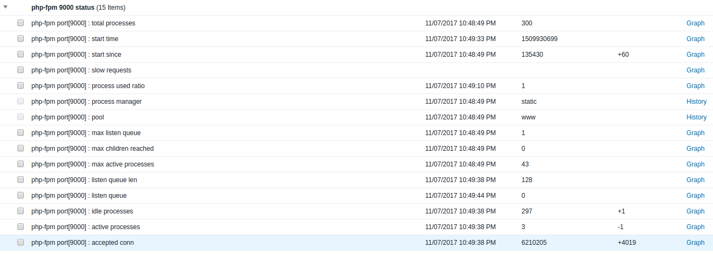
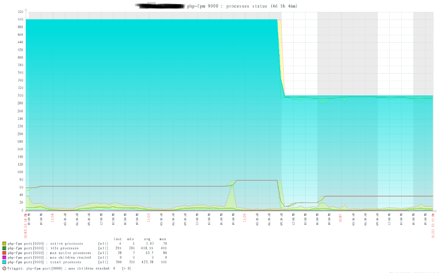

# zabbixMonitorPHPFPM

zabbix自动发现和监控php-fpm状态。

**预览**

## 特性

* 脚本使用bash编写，无需其他开发语言的依赖。
* 支持自动发现php-fpm多个端口，对php-fpm内置状态页数据采集监控。
* 结合nginx + php-fpm 结构的制作的监控。

## 依赖环境

* Linux
* Zabbix3.2 +
* bash
* linux commands: curl, awk, grep, ss ...
* php5.3 +

## 安装指南

1. 复制整个 zabbixMonitorPHPFPM 目录到监控机器的 zabbix agentd scripts 目录中(注意zabbix执行权限问题和sudo ss权限)。
2. 复制 userparameter_phpfpm.conf 到 zabbix agentd etc，注意修改对应的脚本路径。
3. 根据 nginx_phpfpm_status.conf 添加配置到nginx 配置中。
4. 修改要监控的 php-fpm.conf 文件，添加``pm.status_path = /status`` (每个需要监控的php-fpm.conf配置文件都记得开启)。
5. 记得重启监控节点的zabbix agentd。
6. 将模板文件 zbx_export_templates.xml 导入到zabbix.

# 关于

* Author: vastxiao.github.io
* Date: 2017.11.07
* Repo: https://github.com/Vastxiao/zabbixMonitorPHPFPM

